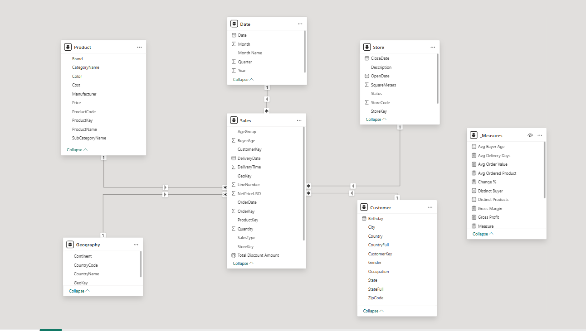

# Contoso Analytics Dashboard

This project was completed by following Bence Borbély’s 3-week Power BI course.

### What I practiced
- Cleaning and transforming datasets  
- Enriching data in Power Query by creating custom and conditional columns  
- Designing a star schema data model  
- Writing DAX formulas for custom measures  
- Building interactive dashboards and visual reports
- Implementing row-level security roles (e.g., filtering data for Europe)  

### Data Model

### Visualization:  

https://github.com/user-attachments/assets/7fa487d1-d16b-4dd5-af1c-f30f286d6e5e

